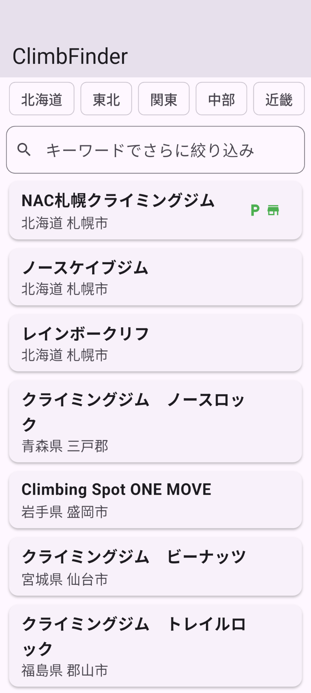
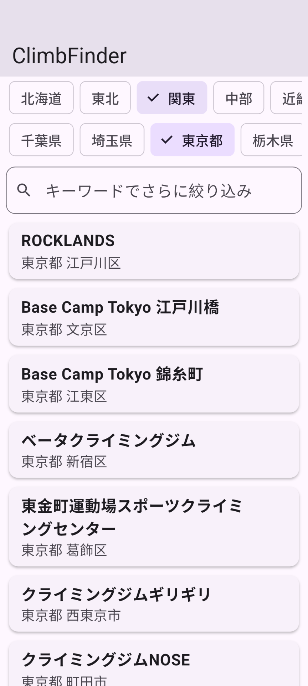
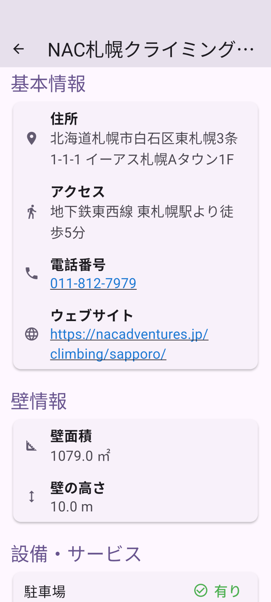

# AI-Assisted Flutter App Samples

このリポジトリは、AI（ChatGPT, Claudeなど）の支援を受けて作成したFlutterアプリケーションのサンプル集です。

## サンプル一覧

- ### [Climb Finder App](./climb-finder-app/)
  - 全国のクライミングジムを検索できるサンプルアプリです。
  - **主な使用技術**: Flutter, Material 3, Firebase App Distribution
  - **AIに支援してもらったこと**:
    - 基本的なUIレイアウトの作成
    - 検索機能の実装、地方、都道府県の絞り込み


<table>
  <tr>
    <td align="center">
      
      <br>
      <b>ホーム画面</b>
    </td>
    <td align="center">
      
      <br>
      <b>検索フィルター画面</b>
    </td>
    <td align="center">
      
      <br>
      <b>詳細画面</b>
    </td>
  </tr>
</table>
---

### **Flutterコマンド**

#### **1. プロジェクトの作成 (`flutter create`)**


##### 基本コマンド
```bash
flutter create <プロジェクト名>
```
これは、Flutterアプリの雛形（ボイラープレート）を丸ごと生成するコマンドです。Android、iOS、Webなどの各プラットフォーム用のフォルダや、設定ファイル(`pubspec.yaml`)、サンプルコード(`lib/main.dart`)などが自動で作成されます。

```

##### 便利なオプション

*   **`--org`**: アプリのパッケージ名を指定します。これはアプリストアでユニークな識別子となるため、非常に重要です。通常は逆ドメイン形式（例: `com.example.appname`）で指定します。

**本格的に開発するなら、こう打ち込むべきでした:**
```bash
# パッケージ名が "dev.misaki.climb_finder" になる
flutter create --org dev.misaki climb_finder
```

#### **2. 依存関係の管理 (`flutter pub`)**

Firebaseやurl_launcherなど、外部のパッケージ（ライブラリ）を追加した後に必ず実行するコマンドです。

##### 基本コマンド
```bash
flutter pub get
```
`pubspec.yaml`ファイルに記述されたパッケージのリストを読み込み、必要なライブラリをダウンロードしてプロジェクトで使えるようにします。

#### **3. アプリの実行とデバッグ (`flutter run`)**

開発中に最も多く使うコマンドです。コードの変更をシミュレーターや実機で確認します。

##### 基本コマンド
```bash
flutter run
```
このコマンドは、以下の処理を一度に行います。
1.  接続されているデバイス（または起動中のシミュレーター/エミュレーター）を検知します。
2.  Dartコードをコンパイルし、アプリをビルドします。
3.  ビルドしたアプリをデバイスにインストールして起動します。
4.  **ホットリロード機能**が有効な状態でアプリが起動します。

##### 起動中の便利な操作

`flutter run` を実行しているターミナルでは、キーボードショートカットが使えます。
*   **`r` (小文字) を入力**: **ホットリロード (Hot Reload)**
    *   コードの変更を**1秒程度**でアプリに反映します。アプリの状態（カウンターの数字など）は維持されます。UIの微調整に最適です。
*   **`R` (大文字) を入力**: **ホットリスタート (Hot Restart)**
    *   アプリの状態をリセットして、最初から再起動します。ホットリロードでうまく反映されない大きな変更があった場合に使います。
*   **`q` を入力**: アプリを終了し、デバッグセッションを停止します。

##### 便利なオプション

*   **`-d`**: 実行するデバイスを指定します。複数のデバイスが接続されている場合に便利です。

```bash
# 接続されているデバイスの一覧を表示
flutter devices

# 表示されたIDを指定して、特定のデバイスで実行
flutter run -d <デバイスID>

# 例: iPhone 14 Proで実行
flutter run -d 'iPhone 14 Pro'

# 例: Chromeブラウザで実行
flutter run -d chrome
```

---

#### **4. アプリのビルド（コンパイル） (`flutter build`)**

開発が完了し、アプリストアに公開するための「リリース版」アプリファイルを作成するコマンドです。`flutter run`とは違い、デバッグ情報を含まない最適化されたファイルが生成されます。

##### Android用
```bash
# Google Playストアに推奨されるApp Bundle形式でビルド
flutter build appbundle

# 旧来のAPK形式でビルド
flutter build apk
```
ビルドが成功すると、`build/app/outputs/bundle/release/` や `build/app/outputs/flutter-apk/` にファイルが作成されます。

##### iOS用
```bash
# iOS用のリリースビルド
flutter build ios
```
ビルドが成功すると、Xcodeでアプリをアーカイブし、App Store Connectにアップロードする準備が整います。最終的な公開作業はXcodeから行います。
